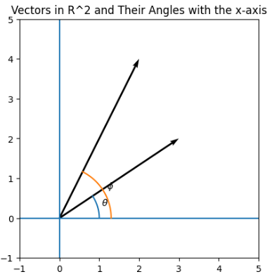

Inner products have very important properties, and we will go through them here.

First of all an inner product induces the concept of an **angle** between vectors in a vector space.

To understand this we first look at a simple case namely $\mathbb{R}^2$

Consider the figure below of two vectors in $\mathbb{R}^2$ with angles $\phi$ and $\theta$ relative to the 1. axis.

  

