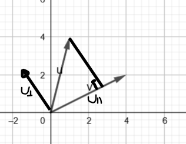

To get a grip on this we start in $\mathbb{R}^2$.

Consider the two **not orthogonal** vectors $ \mathbf{u}=(1,4) \text{  } \mathbf{v}=(4,2)$ depicted below

  

Can we from say vector $\mathbf{u}$ and $\mathbf{v}$ uniquely construct two new vectors $\mathbf{u}_{\perp}$ and $\mathbf{u}_{\parallel}$ such that:

$\mathbf{u}_{\perp}$ that is orthogonal to $\mathbf{v}$ 

$\mathbf{u}_{\parallel}$ that is parallel to $\mathbf{v}$?

And such that $\mathbf{u}=\mathbf{u}_{\parallel}+\mathbf{u}_{\perp}$, implying they constitute an orthogonal basis for $\mathbb{R}^2$.