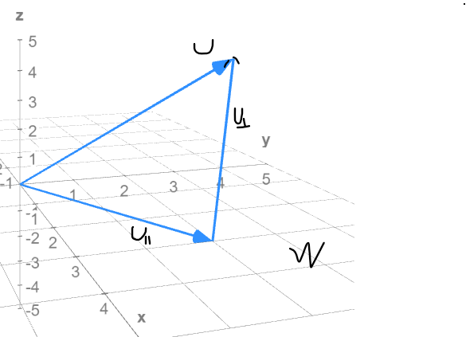

What we have discussed can be generalized to higher dimensions and this is a very useful property of inner product spaces.

Consider a finite dimensional vector space $V$ with dimension $n$ and a **subspace** $W\subset V$ with dimension $k<n$.

  

